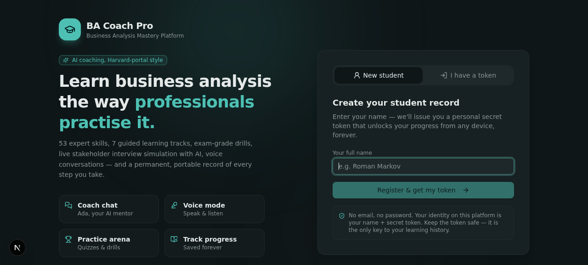
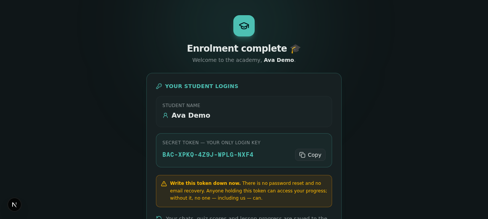
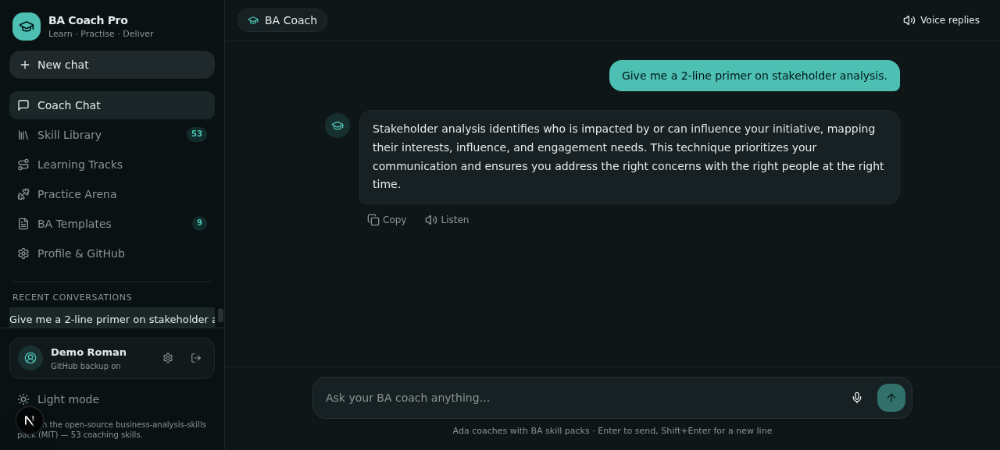
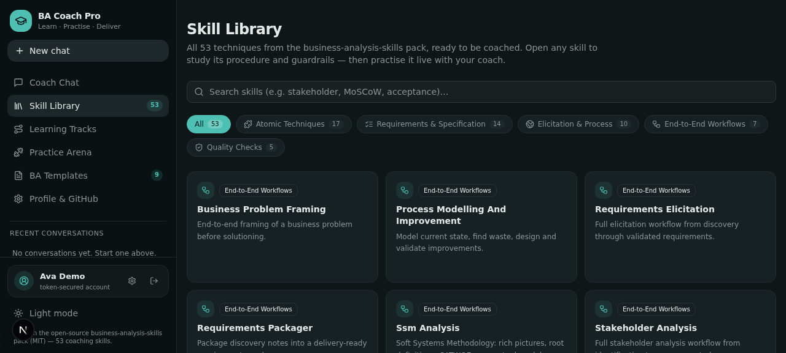
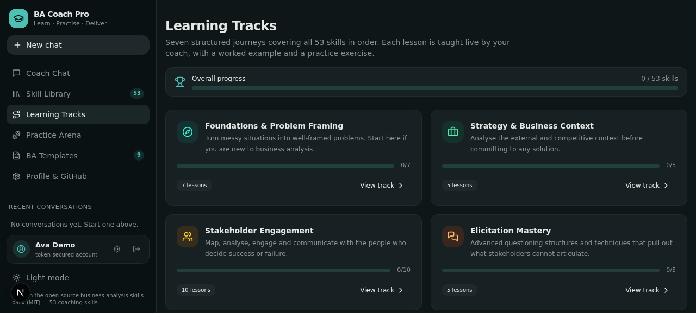
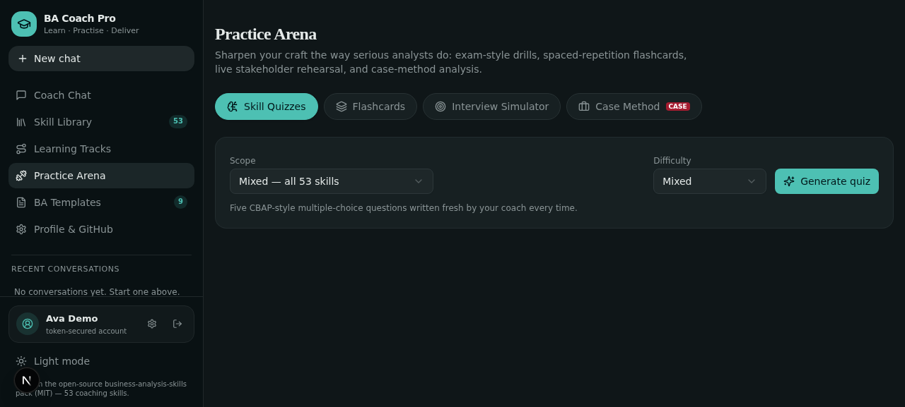
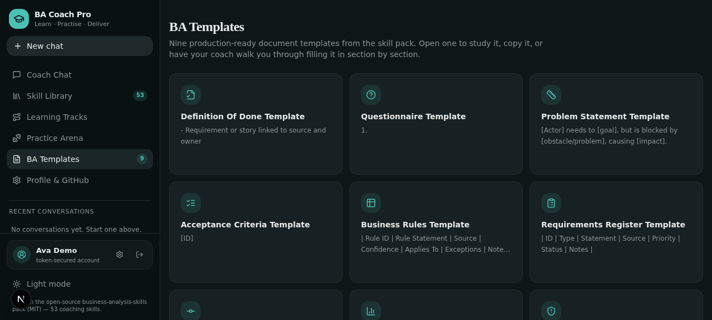
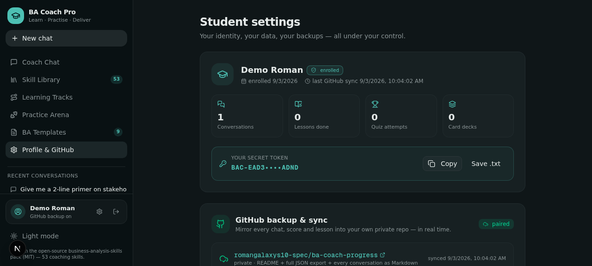

<div align="center">


<br/>

# 🎓 BA Coach Pro

**Your personal Business Analyst coach — an always-available AI mentor that teaches, drills,**

**role-plays and audits your path from messy problem to delivery-ready requirements.**

53 expert skills · 7 learning tracks · live interview simulator · voice mode · student tokens · GitHub-backed progress

</div>

---

## What is BA Coach Pro?

**BA Coach Pro is an open-source, full-stack business-analysis coaching platform.** Think of a Harvard-style course portal wired to an AI coach ("Ada") who has internalised a complete, curated BA skill pack — and who never gets tired of your questions. It coaches you through framings and techniques step by step, role-plays difficult stakeholders, grades your quizzes, tracks your mastery across seven structured tracks, and — uniquely — **hands you a secret student token and mirrors your entire learning history into your own private GitHub repository in real time.**

One student + one AI coach + one private repo = a permanent, portable record of your growth as an analyst.

- **Student tokens, not passwords** — register with your name, receive a `BAC-XXXX-XXXX-XXXX-XXXX` secret token, and use it to resume your education from any device, forever. No email, no reset links, no tracking.
- **GitHub pairing** — paste a Personal Access Token + a repo name; BA Coach Pro auto-creates a private repo and live-syncs every chat, quiz and lesson into it. Wipe the server, switch laptops, start fresh — press *Restore* and everything comes back.

---

### Table of Contents

[The Story](#-the-story) · [Features](#-features) · [The Student Token System](#-the-student-token-system) · [GitHub Backup & Sync](#-github-backup--sync) · [The Harvard-Inspired Learning Experience](#-the-harvard-inspired-learning-experience) · [Quick Start](#-quick-start) · [Screenshots](#-screenshots) · [API Reference](#-api-reference) · [Architecture](#-architecture) · [Tech Stack](#-tech-stack) · [FAQ](#-faq) · [Author](#-author) · [License](#-license)

---

## 📖 The Story

> *"Most BA education is either a $2,000 course or a 40-minute YouTube video. Neither one talks back. I wanted the thing in between: a coach that knows the whole skill pack, drills you like a certification exam, argues with you like a real stakeholder — and never loses your homework."* — **Roman**, [rommark.dev](https://www.rommark.dev)

**BA Coach Pro was built by Roman ([www.rommark.dev](https://www.rommark.dev)) with the Z.ai GLM-5 series** — GLM-5 as the architect and code engine across the entire stack, in a tight human-in-the-loop build loop:

- **GLM-5 designed the data model** — students, conversations, quiz attempts, lesson progress and flashcard stats, all strictly scoped per student so progress survives patches, rebuilds and server moves.
- **GLM-5 authored the coach persona engine** — one prompt compiler that turns 53 SKILL.md playbooks into four distinct coaching behaviours: mentor, skill trainer, stakeholder actor, and post-simulation examiner.
- **GLM-5 engineered the GitHub sync layer** — token verification, private-repo auto-provisioning, SHA-aware file upserts, per-student serialised sync queues and one-command restore.
- **GLM-5 built the voice pipeline** — MediaRecorder → WAV down-sampling → speech-to-text → streamed reply → text-to-speech with selectable coach voices.

The result is a platform that would have taken a small team a quarter to build — shipped in days, open-sourced, and free to self-host.

---

## ✨ Features

- **🧠 AI Coach Chat ("Ada")** — a senior-BA persona (ISEB/BCS, PMI-PBA, CBAP grade) that frames problems, teaches techniques, challenges your assumptions and never just gives canned answers.
- **📚 Skill Library — 53 techniques** — the full open-source [business-analysis-skills](https://github.com/45ck/business-analysis-skills) pack: purpose, when-to-use, procedure, outputs, guardrails and completion criteria for every skill — each one taught live by the coach.
- **🛤️ 7 Guided Learning Tracks** — Foundations → Strategy → Stakeholders → Elicitation → Requirements → Process → Quality, with per-track progress bars and mastery checkboxes that persist.
- **🎯 Live Interview Simulator** — Ada plays a stakeholder with a hidden agenda across randomised domains and difficulty levels; end the simulation and receive a structured debrief (scores, what worked, missed opportunities, the 3 questions you should have asked).
- **🏋️ Practice Arena** — CBAP-style multiple-choice quizzes generated fresh every run, spaced-repetition flashcards, the interview simulator, and case-method exercises with model answers.
- **📄 9 Document Templates** — problem statement, acceptance criteria, business rules, requirements register and more — each copyable and coach-walkthrough-ready.
- **🎙️ Voice Mode** — talk to your coach and hear spoken replies; multiple coach voices, auto-speak toggle, full push-to-talk recording pipeline.
- **🔐 Student Token Identity** — passwordless, email-free enrolment with a human-transcribable secret token (no ambiguous characters).
- **☁️ GitHub Personal Backup** — auto-created private repo per student, real-time sync of every chat and score, and one-click restore on any instance.
- **🌗 Light/Dark, Harvard-portal UX** — enrolment ceremony, registrar-style intro card, course-catalog tracks, mastery progress — polished on mobile and desktop.

---

## 🔐 The Student Token System

Education needs identity, and identity needs to be simple, private and permanent. BA Coach Pro deliberately skips the password reset email hamster wheel:

1. **Open the site → enter your name → click *Register*.**
2. You receive an **enrolment card** with your logins: your name + an auto-generated secret token (`BAC-XXXX-XXXX-XXXX-XXXX`, built from an unambiguous alphabet — no `0/O/1/I` — so you can read it aloud or copy it by hand).
3. **The token is the only key.** There is no password reset and no email recovery — by design. Anyone holding the token can access your progress; without it, no one can.
4. Log in on any device by pasting the token. All conversations, quiz attempts, lesson completions and flashcard stats are **stored in the platform database and scoped to your student ID**, so they survive patches, restarts and redeployments.
5. Optional (recommended): pair your account with GitHub and your data becomes *doubly* permanent — mirrored into your own private repo in real time (next section).

```
You open the site          You enter your name          You get your logins
      │                            │                              │
      ▼                            ▼                              ▼
┌─────────────────┐      ┌──────────────────┐        ┌────────────────────────────┐
│  🎓 BA Coach Pro │  →   │  "Demo Roman"    │   →    │  NAME:  Demo Roman         │
│  (welcome gate) │      │  [Register]      │        │  TOKEN: BAC-7K2M-QP9X-…    │
└─────────────────┘      └──────────────────┘        │  ⚠ write it down — it's     │
                                                     │    the only login key      │
                                                     └────────────────────────────┘
```

---

## ☁️ GitHub Backup & Sync

Paste a **GitHub Personal Access Token** and a **repo name** in *Profile & GitHub → Pair account with GitHub*. The platform:

1. **Verifies** the token against the GitHub API (`GET /user`).
2. **Auto-creates a private repo** under your account if it doesn't exist.
3. **Mirrors your entire learning state** into it — in real time, after every chat reply, quiz attempt and lesson toggle (serialised and coalesced per student to respect GitHub rate limits):

```
your-private-repo/
├── README.md                      # human-readable progress report (auto-updated)
├── export/
│   └── ba-coach-export.json       # full machine-readable export — restore-ready
├── progress/
│   ├── lessons.json               # completed learning-track items
│   ├── quiz-attempts.json         # quiz history with scores
│   └── flashcards.json            # spaced-repetition stats
└── conversations/
    ├── 001-stakeholder-analysis-primer.md   # every chat, as readable Markdown
    └── 002-…md
```

4. **Restore anywhere.** Press *Restore from GitHub* on any instance — fresh laptop, new deployment, wiped database — and your progress, chats and scores are rebuilt from the repo. Your education now outlives the server it was born on.

---

## 🛰️ The AI Tunnel — free GLM-5 on any host

**The problem.** Z.ai's internal GLM-5 models (chat, TTS, ASR) live behind an internal endpoint that only a Z.ai sandbox instance can reach. A public Vercel deployment has no API key and no route to that endpoint — so out of the box its AI features would be dark.

**The solution — a proxy tunnel, the same way space-z.ai works.** Every model call in BA Coach Pro flows through one gateway (`src/lib/ai.ts`) with a three-step resolution chain:

```
1. AI_TUNNEL_URL  →  forward the call to a host that CAN reach the models
2. ZAI_API_KEY    →  direct OpenAI-compatible API (api.z.ai)
3. z-ai-web-dev-sdk  →  local sandbox resolution (default inside Z.ai)
```

Set `AI_TUNNEL_URL` on your hosting platform to point at any running Z.ai sandbox instance of this app — its `/api/tunnel` endpoint executes chat, TTS and ASR locally with the internal GLM-5 models and returns the results:

```
Browser → Vercel (no key, no SDK) ──AI_TUNNEL_URL──▶ Z.ai sandbox preview
                                                    └─ /api/tunnel → GLM-5 chat · TTS · ASR
```

**Setup (2 minutes):**

1. Open this repo in a Z.ai sandbox (or use your existing space-z.ai instance) and keep it running — that instance becomes the tunnel exit node.
2. On Vercel (or any host), add one environment variable:

   ```bash
   AI_TUNNEL_URL=https://preview-<your-instance-id>.space-z.ai
   # optional shared secret — set TUNNEL_KEY on the sandbox and the same value here:
   AI_TUNNEL_KEY=<secret>
   ```

3. Redeploy. Chat, quiz, flashcards, interview simulator and voice mode all go live — with zero API cost.

**Notes.**

- `GET /api/tunnel` returns a health JSON — handy for verifying the tunnel endpoint before wiring it up.
- The sandbox must stay running; it is the thing actually talking to the models. For production installs prefer `ZAI_API_KEY` (direct, no dependency on a sandbox).
- Set `TUNNEL_KEY` on the sandbox instance (and `AI_TUNNEL_KEY` on the client) to require a shared secret on every tunnel call.

---

## 🔌 Bring Your Own AI — custom providers per student

Every student can plug **their own AI key** into their profile (Settings → **AI provider**). Their key is used for *their* chats, quizzes and flashcards — it wins over the deployment-wide AI (tunnel / `ZAI_API_KEY` / SDK) wherever they log in.

One-click presets with verified endpoints:

| Preset | Base URL (OpenAI-compatible) | Example models | Key from |
|---|---|---|---|
| 🟢 Z.ai Coding Plan | `https://api.z.ai/api/coding/paas/v4` | `glm-4.7`, `glm-4.6`, `glm-4.5` | z.ai subscribe |
| 🟩 NVIDIA NIM | `https://integrate.api.nvidia.com/v1` | `meta/llama-3.3-70b-instruct`, `deepseek-ai/deepseek-r1` | build.nvidia.com (free tier) |
| 🔵 OpenCode Zen | `https://opencode.ai/zen/v1` | `code-supernova`, `grok-code`, `kimi-k2.7` | opencode.ai/auth |
| 🟠 OpenAdapter | `https://api.openadapter.dev/v1` | any of the 79+ aggregated models | openadapter.dev |
| ⚙️ Custom | any OpenAI-compatible URL | e.g. OpenRouter, Groq, DeepSeek, local Ollama | — |

**How it works:**

1. Pick a preset (or *Custom*), paste your API key, choose a model → **Save & test connection** (a tiny live completion verifies the key, URL and model, with human-friendly errors for 401/404/429/DNS).
2. Just chat. The gateway (`src/lib/ai.ts`) resolves the student's own provider **first**, then falls back to the deployment chain:
   `student provider → AI_TUNNEL_URL → ZAI_API_KEY → z-ai-web-dev-sdk`.
3. Security: the key is stored server-side on the student's account, **never returned to any client** (masked display only, e.g. `test••••5678`), and **never synced to GitHub** backups. Changing the key re-requires a fresh test; removing the provider returns the student to the deployment default.

**API:** `GET/PUT/DELETE /api/ai-provider` (masked state / save / reset) · `POST /api/ai-provider/test` (live verification, 45 s timeout).

---

## 🏛️ The Harvard-Inspired Learning Experience

The UX borrows deliberately from elite university course portals — the parts that make learners feel they've joined something serious:

- **Enrolment, not sign-up.** You don't "create an account"; you *enrol*. You receive a registrar-style enrolment card with your name and secret token, and an explicit warning about what that token means — because real academic records demand real responsibility.
- **Course-catalog structure.** Learning Tracks are presented like a course catalogue: seven numbered journeys with descriptions, lesson counts and progress bars — not an infinite content feed.
- **Mastery-based progression.** Skills are checked off only when *you* mark them complete, and every track shows aggregate mastery at a glance (0/53 → 53/53).
- **Active recall everywhere.** Quizzes are generated per-skill on demand, flashcards use spaced-repetition semantics, and the interview simulator forces production, not recognition.
- **Case method.** The Practice Arena includes case-method exercises: a messy scenario, your analysis, and a model answer to argue with.
- **Formative feedback loops.** Every interview debrief scores you, lists what worked, what to improve, missed opportunities and the questions a senior BA would have asked.

---

## 📦 Quick Start

```bash
git clone https://github.com/romangalaxys10-spec/ba-coach-pro.git
cd ba-coach-pro
bun install            # or npm install
echo 'DATABASE_URL=file:./db/custom.db' > .env
bun run db:push        # create SQLite schema
bun run dev            # → http://localhost:3000
```

Open `http://localhost:3000`, enter your name, **save your secret token**, and you're enrolled.

> **Deploying?** Any Node host works (Vercel, Railway, Fly, a $5 VPS). Set `DATABASE_URL` — and for a demo deployment, note SQLite lives on the host filesystem; pair students with GitHub for durable cross-deployment memory. To light up the AI features with no API key, point `AI_TUNNEL_URL` at a running Z.ai sandbox instance (see **🛰️ The AI Tunnel**).

---

## 🖼️ Screenshots

| | |
|---|---|
|  |  |
| *Welcome gate — register in one field* | *Enrolment card — name + secret token* |
|  |  |
| *Ada, coaching in chat — with voice* | *All 53 skills, searchable and filterable* |
|  |  |
| *7 course-catalog tracks with mastery bars* | *Quizzes, flashcards, interview simulator, cases* |
|  |  |
| *9 production-ready BA templates* | *Student profile + GitHub backup & sync* |

---

## 💻 API Reference

All student-scoped endpoints require the header `x-student-token: BAC-…`.

### Auth

```bash
# register → returns your secret token
curl -X POST http://localhost:3000/api/auth \
  -H 'Content-Type: application/json' \
  -d '{"action":"register","name":"Demo Roman"}'

# login with an existing token
curl -X POST http://localhost:3000/api/auth \
  -H 'Content-Type: application/json' \
  -d '{"action":"login","token":"BAC-XXXX-XXXX-XXXX-XXXX"}'

# profile + lifetime stats
curl http://localhost:3000/api/auth -H "x-student-token: $TOKEN"
```

### GitHub pairing & sync

```bash
# pair: verify PaT, auto-create private repo, first full sync
curl -X POST http://localhost:3000/api/github \
  -H "x-student-token: $TOKEN" -H 'Content-Type: application/json' \
  -d '{"action":"pair","patToken":"github_pat_…","repoName":"ba-coach-progress"}'

# force a full sync / restore from repo / unpair
curl -X POST http://localhost:3000/api/github -H "x-student-token: $TOKEN" \
  -H 'Content-Type: application/json' -d '{"action":"sync"}'
curl -X POST http://localhost:3000/api/github -H "x-student-token: $TOKEN" \
  -H 'Content-Type: application/json' -d '{"action":"restore"}'
curl -X POST http://localhost:3000/api/github -H "x-student-token: $TOKEN" \
  -H 'Content-Type: application/json' -d '{"action":"unpair"}'
```

### Endpoints Summary

| Method | Path | Description | Auth |
| --- | --- | --- | --- |
| POST | `/api/auth` | `register` / `login` actions | — |
| GET | `/api/auth` | profile + lifetime stats | ✅ |
| POST | `/api/chat` | coach / skill / interviewer turn (persists + auto-syncs) | ✅ |
| GET/POST/DELETE | `/api/conversations` | list / create / delete conversations | ✅ |
| GET/DELETE | `/api/conversations/[id]` | fetch with messages / delete | ✅ |
| POST | `/api/quiz` | generate MCQ quiz (LLM, strict JSON) | ✅ |
| PUT | `/api/quiz` | save a quiz attempt | ✅ |
| POST | `/api/flashcards` | generate flashcard deck | ✅ |
| GET/PUT | `/api/flashcards` | spaced-repetition stats | ✅ |
| GET/POST | `/api/progress` | lesson completion toggles | ✅ |
| POST | `/api/tts` | text-to-speech (mp3, chunked) | ✅ |
| POST | `/api/asr` | speech-to-text (WAV base64) | ✅ |
| GET/POST | `/api/tunnel` | AI tunnel exit node: health / `llm` · `tts` · `asr` proxy calls | 🔑* |
| POST | `/api/github` | `pair` / `sync` / `restore` / `unpair` / `autosync` | ✅ |

\* `/api/tunnel` requires a key only when `TUNNEL_KEY` is set on the instance; otherwise it is open, like the rest of the public demo.

---

## 📍 Architecture

```
ba-coach-pro/
├── src/
│   ├── app/
│   │   ├── page.tsx                 # auth gate → app shell (view router)
│   │   └── api/                     # route handlers (all student-scoped)
│   │       ├── auth/                #   register / login / profile
│   │       ├── chat/                #   coach turn: persist → LLM → persist → sync
│   │       ├── conversations/       #   conversation CRUD + [id] messages
│   │       ├── quiz/ flashcards/    #   LLM generators + attempt/stat storage
│   │       ├── progress/            #   lesson completion
│   │       ├── github/              #   pair / sync / restore / unpair / autosync
│   │       ├── tunnel/              #   AI tunnel exit node (llm / tts / asr proxy)
│   │       └── tts/ asr/            #   voice pipeline
│   ├── components/                  # auth-gate, chat-view, skills-library,
│   │                                # learn-view, practice-view, templates-view,
│   │                                # settings-view, app-sidebar, markdown
│   ├── lib/
│   │   ├── coach-prompt.ts          # Ada persona compiler (4 modes + scenario gen)
│   │   ├── github-sync.ts           # repo provisioning, upserts, queues, restore
│   │   ├── auth.ts                  # token generation + request authentication
│   │   ├── store.ts                 # zustand app state
│   │   └── voice-client.ts          # MediaRecorder → WAV → base64
│   └── data/skills-data.ts          # 53 skills + 9 templates extracted from the pack
├── prisma/schema.prisma             # Student-scoped data model
└── docs/screenshots/                # the screenshots above
```

### Data Model

```
Student 1───* Conversation 1───* Message
   │
   ├──* QuizAttempt        (skillSlug, category, score, total, details)
   ├──* LessonProgress     (itemId, completed)          unique(studentId, itemId)
   └──* FlashcardStat      (skillSlug, known, total)    unique(studentId, skillSlug)

Student.github*          → githubToken · githubOwner · githubRepo · githubSyncedAt · autoSync
```

Every row hangs off `Student` — delete the student and everything cascades; export the student and everything travels.

---

## 🔧 Tech Stack

| Layer | Technology |
| --- | --- |
| Framework | [Next.js 16](https://nextjs.org) (App Router) + React 19 |
| Language | [TypeScript 5](https://www.typescriptlang.org) |
| Styling | [Tailwind CSS 4](https://tailwindcss.com) + shadcn/ui + oklch design tokens |
| Database | [Prisma 6](https://www.prisma.io) + SQLite (swap `DATABASE_URL` for Postgres in production) |
| State | [zustand 5](https://zustand.docs.pmnd.rs) |
| AI | [Z.ai GLM-5 series](https://z.ai) via `z-ai-web-dev-sdk` — chat, quiz/flashcard generation, TTS, ASR |
| Voice | MediaRecorder → 16 kHz mono WAV → base64 → ASR; chunked MP3 TTS playback |
| Backup | GitHub REST API (contents upserts, SHA-aware) |
| Skill content | [business-analysis-skills](https://github.com/45ck/business-analysis-skills) (MIT) |

---

## ❓ FAQ

**Is my secret token really the only login?**
Yes. It's a 20-character key from an unambiguous alphabet, checked case-insensitively with whitespace stripped. Treat it like an API key — because that's exactly what it is.

**What happens if I lose my token?**
Without a GitHub pairing, the data is unreachable (by design — we can't recover what we can't authenticate). With GitHub pairing, simply pair a fresh account with the same repo and press *Restore*: your progress, chats and scores come back.

**Where is my data stored?**
In the platform's own database (SQLite by default), scoped to your student ID. If you pair GitHub, a mirror lands in *your own private repo* after every interaction — you can read it, fork it, or delete it whenever you like.

**Which AI powers the coach?**
The Z.ai GLM-5 series through the `z-ai-web-dev-sdk`. The coach's behaviour comes from a prompt compiler that injects the relevant SKILL.md playbook, mode instructions and (for interviews) a randomised stakeholder scenario with a hidden information agenda.

**Can I use it for a whole classroom or bootcamp?**
That's the point of student tokens — every learner self-enrols in seconds and owns their record. Deploy one instance, share the URL, and let each student pair their own GitHub repo.

**Does the quiz generator hallucinate answers?**
Mitigations: questions are grounded in the actual skill pack content (purpose, procedure, guardrails are injected into the generation prompt), output is schema-validated, and every question carries an explanation.

**Why no passwords or emails?**
Because the threat model doesn't need them for a self-hosted learning tool, and removing them removes the entire account-recovery attack surface. Your token *is* your account; GitHub pairing is your recovery.

**Can I swap SQLite for Postgres?**
Yes — change the Prisma datasource and `DATABASE_URL`. The schema is portable.

---

## 👤 Author

**Roman** — builder of AI-native products, [www.rommark.dev](https://www.rommark.dev)

- 🌐 Portfolio: [www.rommark.dev](https://www.rommark.dev)
- 💼 Built with: [Z.ai GLM-5 series](https://z.ai)
- 📦 Other repos: [memtrant](https://github.com/romangalaxys10-spec/memtrant) · [membox](https://github.com/romangalaxys10-spec/membox)

---

## 📦 License

[MIT](LICENSE) — use it, fork it, deploy it, teach with it. Keep the attribution.

---

<div align="center">

**Built with [Z.ai GLM-5](https://z.ai) • Designed & developed by [Roman](https://www.rommark.dev)**

🎓 *BA Coach Pro — because every analyst deserves a coach that remembers.*

</div>
